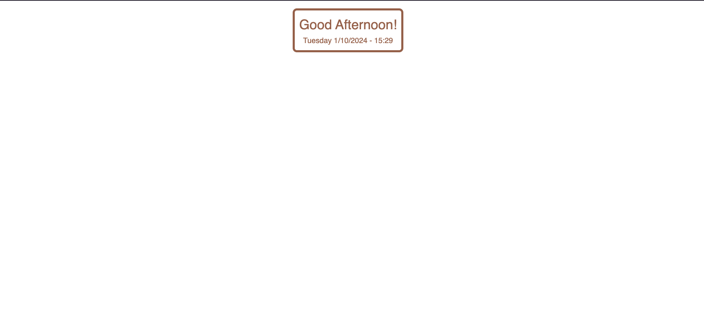

# Widget Greetings for Notion 🌟

Welcome to **Widget Greetings**! 
This is a custom widget created with HTML, CSS, and JavaScript to make your Notion workspace more stylish and welcoming. 
It displays personalized greetings that adapt to the time of day!

## 📋 Table of Contents
- [Demo](#demo)
- [Features](#features)
- [Installation](#installation)
- [How to Use](#how-to-use)
- [Customization](#customization)
- [Support](#support)

## 🎥 Demo
Here’s a preview of the widget in action:



## ✨ Features
- Dynamic greetings based on the time of day (morning, afternoon, evening).
- Customizable with your own colors and fonts.
- Easy integration into Notion.

## 🚀 Installation

To add the **Widget Greetings** to your Notion workspace, follow these steps:

1. **Copy the widget url**:

  https://aninhabort.github.io/widget-greeting/

2. **Create an Embed block** in Notion:
   - In your Notion page, type `/embed` and paste the widget code.

3. **Save and enjoy!** 🎉

## 🛠 How to Use
The widget displays dynamic greetings based on the current time of day:

- **Good Morning!** (in the morning)
- **Good Afternoon!** (in the afternoon)
- **Good Evening!** (in the evening)

It's super easy to set up and perfect for personalizing your Notion space!

## 🎨 Customization
If you want to tweak the design of the widget, you can directly edit the CSS and JavaScript in the provided code. Here are some customization tips:

- **Colors**: Modify the CSS properties to adjust the colors.
- **Fonts**: You can change the font using Google Fonts or another font library.
  
Example:
   ```css
   * {
    font-family: 'Roboto', sans-serif;
    color: #9f6b53;
    }

    #widget {
    background-color: rgb(255, 255, 255);
    }
   ```
